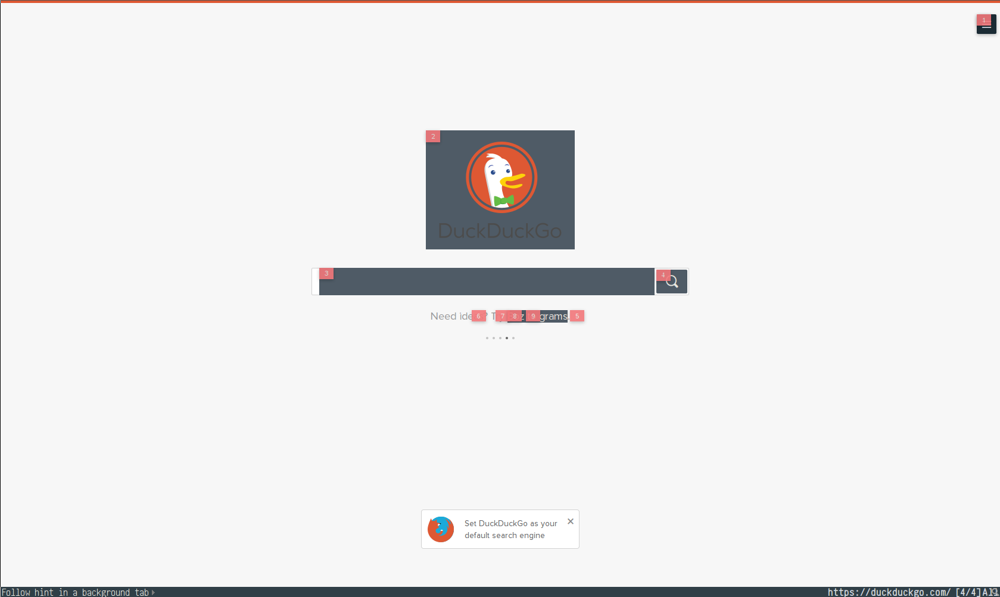
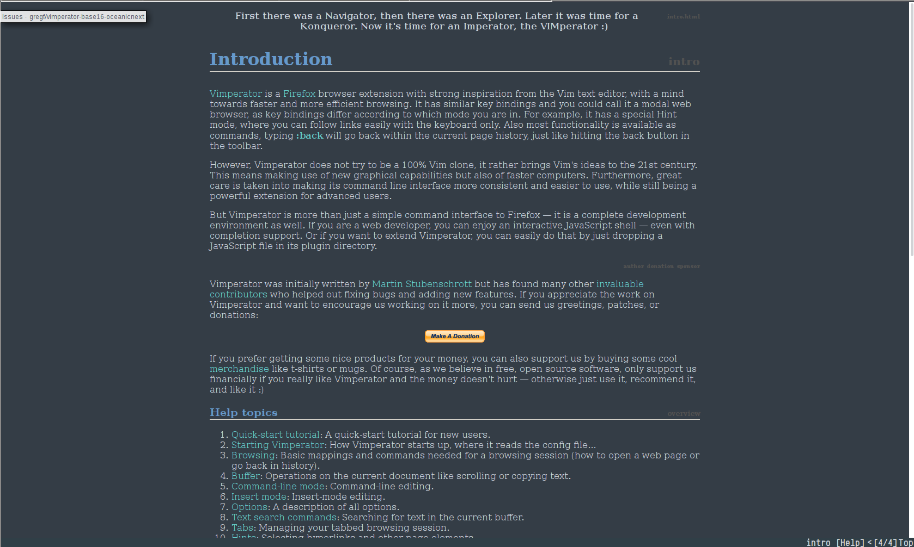

# Vimperator Oceanic Next Theme

This is a color scheme for the
[vimperator](http://www.vimperator.org/vimperator/) add-on for
[Firefox](https://www.mozilla.org/en-US/firefox/new/). It uses the color
palette
[oceanic-next](https://github.com/voronianski/oceanic-next-color-scheme),
designed by Dmitri Voronianski.

If you have any suggestions, or find any bugs please enter an
[issue](https://github.com/gregf/vimperator-base16-oceanicnext/issues).

## Install

To install this color scheme, copy it into your `~/.vimperator/colors` folder.

``` 
$ mkdir -p ~/.vimperator/colors
$ cp base16-oceanicnext.vimp ~/.vimperator/colors
```

Then change your default theme by adding the following to your
`~/.vimperatorrc`.

`colorscheme base16-oceanicnext`

Then resource your `~/.vimperatorrc`, or restart your browser to see the
changes go into effect.

`:source ~/.vimperatorrc`


## Screenshots

### Normal


### Insert


### Menu


### Selected


### Hints



### Help


